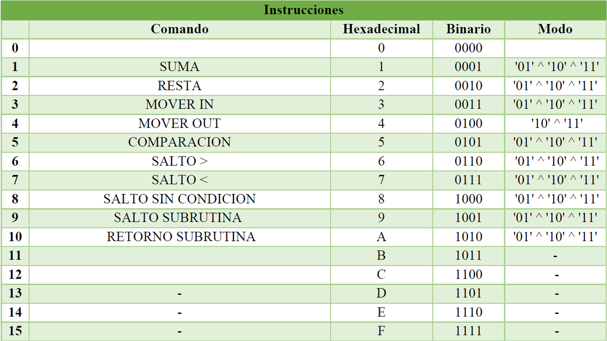

# Procesador-en-VHDL---VHDL-Processor
### Se desarrolló un procesador multipropósito capaz de realizar operaciones aritméticas básicas de suma y resta entre dos números de entre 1 y 16 bits leídos de una memoria RWM de 1024 posiciones.  

* El procesador tiene capacidad de interrumpir el programa debido a una señal externa dada por el usuario, y la posibilidad de moverse entre diferentes posiciones de la memoria para así ejecutar programas de mayor complejidad.

* El procesador ejecuta operaciones entre datos leídos desde memoria y almacena los resultados de la operación en la misma. Esta memoria es de lectura y escritura y para seleccionar una posición de memoria se debe usar una dirección de 10 bits.

* Para la descripción de cada uno de los bloques funcionales del proyecto se usó el __lenguaje de descripción de hardware VHDL.__
## Partes del procesador
### __A continuación, se presentan unas de las partes mas importantes del procesador.__
### Formato Instrucciones Procesador
Teniendo en cuenta que, el máximo de memoria a usar son 1KB, y que en sistema binario 210 es 1024, el número de bits para cada dirección es de 10 bits. Ahora, partiendo del tamaño de instrucciones se procede a diferenciar, caracterizar y seleccionar qué función o propósito tendrá cada una.

  

### Instrucciones Procesador
La primera función que se tiene es la de realizar operaciones aritméticas como la suma, la resta y la multiplicación de los datos e información que el programa necesite realizar. Estas operaciones están condensadas o agrupadas dentro del procesador en una sección llamada ALU (unidad aritmética y lógica) la cual se encargará de realizar el procesamiento requerido y necesario por el programa.

La segunda función es el manejo de múltiples registros dentro del procesador para que de esta forma varias porciones de información y de instrucciones puedan ser procesadas, manipuladas y ejecutadas, creando así una forma más cómoda para el trabajo con los datos.

  

### Diagrama Bloques Procesador

  

### Compuertas lógicas bloque Program Counter
Dentro del procesador se encuentra el bloque __Program Counter__ el cual es un contador que debe estar en la capacidad de inicializarse en un valor específico de modo que cuenta con una señal de Carga proveniente del control y una señal de entrada llamada “NUM” que es el número con el que se inicializa el contador.

  

